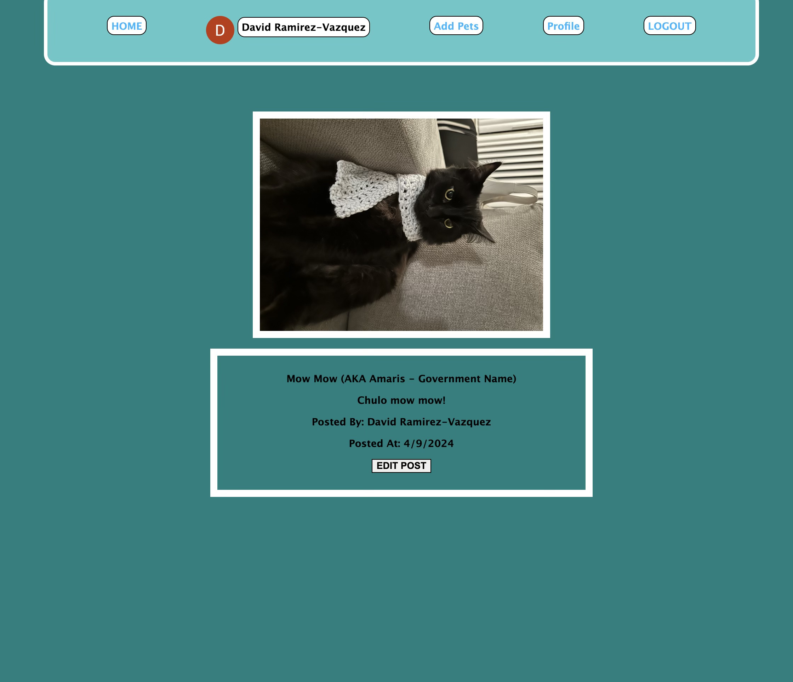

# PETPAWRAZZI

## Description
This website is a safe space to show our beautiful pets. Providing the ability to create separate profile pages within your account for every pet you desire to share. Dogs, cats, lizards, tutrles, snakes, hamsters; any pet at all or even none at all - are all WELCOME! :D 🐶🐱🦎🐢🐎

## Login Page
Users must first sign in to enter the website. Additionally, a link to adopt if provided if users would like to adopt!

## Home Page
The nav bar is provided for every page on the website.
Users at the home page will see ALL posts created. Also with their comments, and a space to comment. The owner of the comments will be able to delete their comment if desired.

## User Profile Page
Users at their profile page will be able to see all of their pets' posts combined in one page as well as links to redirect to the pet profile pet.

### Add Pet Page
At the add pet page, users will be asked to tell us about their pet, to give us their pet info.

## Pet Profile Page
Upon adding the pet, users will be rediercted to their pet profile page where they will see all the posts pertaining to that pet and that pet only as it is their profile page. From there, on every post, users will be able to look open to the page displaying the selected post only.

## Create Post Page
If the pets do not have a post the users can create a post for that pet

## Post Page
Users will be able to view their pets specific post on a page. There, they will also be able to redirect to an edit button if desired.

Upong Editing, users will be redirected back to the post page.

## Technologies Used
### HTML CSS JAVASCRIPT MONGODB MONGOOSE EXPRESS

## Getting Started
### Trello Board
https://trello.com/b/eupQwlzg/petpawrazzi
### ERD:
https://lucid.app/lucidchart/2b0feecb-8324-4ce1-8165-56be537de858/edit?viewport_l[…]1618%2C0_0&invitationId=inv_261061b1-50b1-47d9-abd7-93ed49025412
### Wireframe:
https://www.figma.com/file/NqBOCJkNBUQM2LXEzqkji1/Petpawrazzi-ERD?type=whiteboard&node-id=0%3A1&t=lBrMlxYaBAuv2uKK-1
### Deployment Link
https://petpawrazzi-dc48e6f218b0.herokuapp.com/

## Next Steps
1. I would like to make the website more reactive. Apart from bettering the styling, I plan to do this by have each pet name, user name displayed to redirect to the user/pet profile.
2. I would like to add like buttons for each post
3. I would also like to add API that helps determine the breeds when a photo is submitted. 